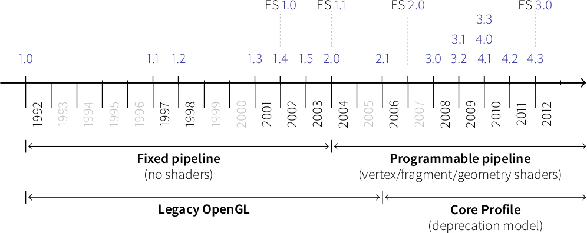

===============================================================================
Getting started
===============================================================================

.. contents::
   :local:
   :depth: 1

Packages requirements
===============================================================================

The only mandatory requirements for vispy is the `numpy <http://numpy.org>`_
package. The most straightforward way to install it is:

.. code-block:: bash

   $ pip install numpy

Backends requirements
===============================================================================

Vispy requires at least one toolkit for opening a window and creates an OpenGL
context. This can be done using one of the standard C/C++ toolkits (Qt, GLFW,
glut, pygame, SDL2, Wx, GTK2 or GTK3) and requires the corresponding python
bindings or a pure python toolkit such as pyglet.

.. warning::

   You only need to have one of these packages, no need to install them all !

===================== === ==== ====== ==== ==== ===
**Modern Backends**   Qt  GLFW Pyglet SDL2 GTK3 Wx3
--------------------- --- ---- ------ ---- ---- ---
Multiple windows       ✓   ✓     ✓     ✓    ✓    ✓
--------------------- --- ---- ------ ---- ---- ---
Non-decorated windows  ✓   ✓     ✓     ✓    ✓    ✓
--------------------- --- ---- ------ ---- ---- ---
Set GL API             ✓   ✓    —      ✓    ✓    ✓
--------------------- --- ---- ------ ---- ---- ---
Share GL Context       ✓   ✓     ✓     ✓    ✓    ✓
--------------------- --- ---- ------ ---- ---- ---
Fullscreen             ✓   ✓     ✓     ✓    ✓    ✓
--------------------- --- ---- ------ ---- ---- ---
Unicode handling       ✓   ✓     ✓     ✓    ✓    ✓
===================== === ==== ====== ==== ==== ===

======================== === ==== ======== ====== =======
**Old school backends**  Wx2 Glut Freeglut Pygame GTK 2.x
------------------------ --- ---- -------- ------ -------
Multiple windows          ✓   —      —       —      ✓
------------------------ --- ---- -------- ------ -------
Non-decorated windows     ✓   ✓      ✓       ✓      ✓
------------------------ --- ---- -------- ------ -------
Set GL API                —   —      —       —      —
------------------------ --- ---- -------- ------ -------
Share GL Context          —   —      —       ✓      ✓
------------------------ --- ---- -------- ------ -------
Fullscreen                ✓  ✓       ✓       ✓      ✓
------------------------ --- ---- -------- ------ -------
Unicode handling          ✓   —      —       ✓      ✓
------------------------ --- ---- -------- ------ -------
Scroll event              ✓   —      ✓       —      ✓
======================== === ==== ======== ====== =======

    "Window position get/set" : True,
    "Window size get/set"     : True,
    "Multiple windows"        : False,
    "Mouse scroll events"     : False,
    "Non-decorated window"    : True,
    "Non-sizeable window"     : False,
    "Fullscreen mode"         : True,
    "Unicode processing"      : False,
    "Set GL version"          : False,
    "Set GL profile"          : False,
    "Share GL context"        : False,

Qt
-------------------------------------------------------------------------------

`Qt <http://qt-project.org>`_ is a cross-platform application and UI framework
for developers using C++ or QML, a CSS & JavaScript like language. Qt Creator
is the supporting Qt IDE. There are (at least) two sets of availble python
bindings. `PyQT <http://pyqt.sourceforge.net>`_ supports Python v2 and v3 and
Qt v4 and Qt v5 and is available under the GPL and commercial licenses. `PySide
<http://qt-project.org/wiki/PySide>`_ provides LGPL-licensed Python bindings
for Qt. PySide Qt bindings allow both free open source and proprietary software
development and ultimately aim to support Qt platforms.

GLFW
-------------------------------------------------------------------------------

`GLFW <http://www.glfw.org>`_ is an Open Source, multi-platform library for
creating windows with OpenGL contexts and managing input and events. It is easy
to integrate into existing applications and does not lay claim to the main
loop. There is no need to install bindings because vispy comes with the glfw
bindings (cloned from the `pyglfw <https://github.com/rougier/pyglfw>`_ project).

GLUT
-------------------------------------------------------------------------------

`GLUT <http://www.opengl.org/resources/libraries/glut/>`_ is the OpenGL Utility
Toolkit, a window system independent toolkit for writing OpenGL programs. It
implements a simple windowing application programming interface (API) for
OpenGL. `PyOpenGL <http://pyopengl.sourceforge.net>`_ is the most common
cross platform Python binding to OpenGL and related APIs. The binding is
created using the standard ctypes library and gives access to GLUT.

Pyglet
-------------------------------------------------------------------------------

`Pyglet <http://www.pyglet.org>`_ is a cross-platform windowing and multimedia
library for Python and provides an object-oriented programming interface for
developing games and other visually-rich applications for Windows, Mac OS X
and Linux.

GTK2 (not yet done)
-------------------------------------------------------------------------------

GTK3 (not yet done)
-------------------------------------------------------------------------------

WX2 (not yet done)
-------------------------------------------------------------------------------

WX3 (not yet done)
-------------------------------------------------------------------------------

PyGame (a.k.A. SDL)
-------------------------------------------------------------------------------

SDL2 (a.k.a. PyGame2)
-------------------------------------------------------------------------------

Hardware requirements
===============================================================================

Vispy makes heavy use of the graphic cards installed on your system. More
precisely, vispy makes heavy use of the Graphical Processing Unit (GPU) through
shaders. Vispy thus requires a fairly recent video card (~ less than 12 years
old) as well as an up-to-date video driver such that vispy can access the
programmable pipeline (as opposed to the fixed pipeline):

Linux and OSX
-------------------------------------------------------------------------------

On Linux and OSX platform, you can type:

.. code-block:: bash

   $ glxinfo

The results of the above command and is long list of information related to
your video driver. The most important information for the time being is whether
you have direct access to your video card and what is the GL version and the
shading language version::

   ...
   direct rendering: Yes
   ...
   OpenGL vendor string: NVIDIA Corporation
   OpenGL renderer string: NVIDIA GeForce GT 650M OpenGL Engine
   OpenGL version string: 2.1 NVIDIA-8.24.9 310.40.25f01
   OpenGL shading language version string: 1.20
   ...

The OpenGL version must be at least 2.1 and the shading language version must
be at least 1.1. If this is not the case, you need to install more recent
versions. Have a look a your system documentation or browse online for howtos.

Windows
-------------------------------------------------------------------------------

Installation
===============================================================================

Once numpy and one backend has been installed, you can proceed to the vispy
installation:

.. code-block:: bash

   pip install vispy

Testing installation
-------------------------------------------------------------------------------

It is strongly advised to run the vispy test suite right after installation to
check if everything is ok. To do this, just type:

.. code-block:: pycon

   >>> import vispy
   >>> vispy.test()
   ...

Collecting information
-------------------------------------------------------------------------------

.. code-block:: pycon

   >>> import vispy

   >>> print vispy.info("gl")
   2.1 NVIDIA-8.24.9 310.40.25f01

   >>> print vispy.info("glsl)
   1.20

   >>> print vispy.info("backends.qt")
   4.10.4 (PyQt4)

   >>> print vispy.info("backends.pyglet")
   pyglet 1.2alpha1

   >>> print vispy.info("backends.glfw")
   3.0.4

   >>> print vispy.info("backends.glut")
   3.0.2

   >>> print vispy.info("backends.gtk")
   Not implemented

   >>> print vispy.info("backends.wx")
   Not implemented

   >>> print vispy.info("backends.pygame")
   Not implemented

Hello World !
-------------------------------------------------------------------------------

.. code-block:: python

   import vispy
   vispy.app.Canvas(visible=True)
   vispy.app.run()
