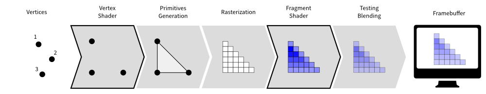
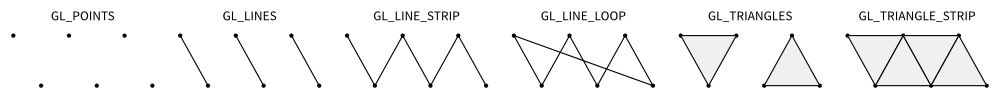

===============================================================================
Modern OpenGL
===============================================================================

Introduction
============

OpenGL has evolved over the years and a big change occured in 2003 with the
introduction of the dynamic pipeline (OpenGL 2.0), i.e. the use of shaders that
allow to have direct access to the GPU.

.. image:: _static/gl-history.png

Before this version, OpenGL was using a fixed pipeline and you may still find a
lot of tutorials that still use this fixed pipeline. This introduces some
radical changes in the way of programming OpenGL and makes it both more
difficult to program but far more powerful.

What are shaders ?
------------------

.. Note::

   The shader language is called glsl.  There are many versions that goes from 1.0
   to 1.5 and subsequents version get the number of OpenGL version. Last version
   is 4.4 (February 2014).

Shaders are pieces of program (using a C-like language) that are build onto the
GPU and executed during the rendering pipeline. Depending on the nature of the
shaders (there are many types depending on the version of OpenGL you're using),
they will act at different stage of the rendering pipeline. To simplify this
tutorial, we'll use only **vertex** and **fragment** shader as shown below:

A vertex shader acts on vertices and is supposed to output the vertex
**position** (→ ``gl_Position``) on the viewport (i.e. screen). A fragment shader
acts at the fragment level and is supposed to output the **color**
(→ ``gl_FragColor``) of the fragment. Hence, a minimal vertex shader is::

  void main()
  {
      gl_Position = vec4(0.0,0.0,0.0,1.0);
  }

while a minimal fragment shader would be::

  void main()
  {
      gl_FragColor = vec4(0.0,0.0,0.0,1.0);
  }

These two shaders are not very useful since the first will transform any
vertex into the null vertex while the second will output the black color for
any fragment. We'll see later how to make them to do more useful things.

One question remains: when are those shaders exectuted exactly ? The vertex
shader is executed for each vertex that is given to the rendering pipeline
(we'll see what does that mean exactly later) and the fragment shader is
executed on each fragment that is generated after the vertex stage. For
example, in the simple figure above, the vertex would be called 3 times, once
for each vertex (1,2 and 3) while the fragment shader would be executed 21
times, once for each fragment (pixel).

What are buffers ?
------------------

We explained earlier that the vertex shader act on the vertices. The question
is thus where do those vertices comes from ? The idea of modern GL is that
vertices are stored on the GPU and needs to be uploaded (only once) to the GPU
before rendering. The way to do that is to build buffers onto the CPU and to
send them onto the GPU. If your data does not change, no need to upload it
again. That is the big difference with the previous fixed pipeline where data
were uploaded at each rendering call (only display lists were built into GPU
memory).

But what is the structure of a vertex ? OpenGL does not assume anything about
your vertex structure and you're free to use as many information you may need
for each vertex. The only condition is that all vertices from a buffer have the
same structure (possibly with different content). This again is a big
difference with the fixed pipeline where OpenGL was doing a lot of complex
rendering stuff for you (projections, lighting, normals, etc.) with an implicit
fixed vertex structure. Now you're on your own...

* **Good news** is that you're now free to do virtually anything you want.
* **Bad news** is that you have to program everything, even the most basic
               things like projection and lighting.

Let's take a simple example of a vertex structure where we want each vertex to
hold a position and a color. The easiest way to do that in python is to use a
structured array using the `numpy <http://www.numpy.org>`_ library::

  data = numpy.zeros(4, dtype = [ ("position", np.float32, 3),
                                  ("color",    np.float32, 4)] )

We just created a CPU buffer with 4 vertices, each of them having a
``position`` (3 floats for x,y,z coordinates) and a ``color`` (4 floats for
red, blue, green and alpha channels). Note that we explicitely chose to have 3
coordinates for ``position`` but we may have chosen to have only 2 if were to
work in two-dimensions only. Same holds true for ``color``. We could have used
only 3 channels (r,g,b) if we did not want to use transparency. This would save
some bytes for each vertex. Of course, for 4 vertices, this does not really
matter but you have to realize it **will matter** if you data size grows up to
one or ten million vertices.

What are uniforms, attributes and varyings ?
--------------------------------------------

At this point in the tutorial, we know what are shaders and buffers but we
still need to explain how they may be connected together. So, let's consider
again our CPU buffer::

  data = numpy.zeros(4, dtype = [ ("position", np.float32, 2),
                                  ("color",    np.float32, 4)] )

We need to tell the vertex shader that it will have to handle vertices where a
position is a tuple of 3 floats and color is a tuple of 4 floats. This is
precisely what attributes are meant for. Let us change slightly our previous
vertex shader::

  attribute vec2 position;
  attribute vec4 color;
  void main()
  {
      gl_Position = vec4(position, 0.0, 1.0);
  }

This vertex shader now expects a vertex to possess 2 attributes, one named
``position`` and one named ``color`` with specified types (vec3 means tuple of
3 floats and vec4 means tuple of 4 floats). It is important to note that even
if we labeled the first attribute ``position``, this attribute is not yet bound
to the actual ``position`` in the numpy array. We'll need to do it explicitly
at some point in our program and there is no automagic that will bind the numpy
array field to the right attribute, you'll have to do it yourself, but we'll
see that later.

The second type of information we can feed the vertex shader are the uniforms
that may be considered as constant values (across all the vertices). Let's say
for example we want to scale all the vertices by a constant factor ``scale``,
we would thus write::

  uniform float scale;
  attribute vec2 position;
  attribute vec4 color;
  void main()
  {
      gl_Position = vec4(position*scale, 0.0, 1.0);
  }

Last type is the varying type that is used to pass information between the
vertex stage and the fragment stage. So let us suppose (again) we want to pass
the vertex color to the fragment shader, we now write::

  uniform float scale;
  attribute vec2 position;
  attribute vec4 color;
  varying vec4 v_color;

  void main()
  {
      gl_Position = vec4(position*scale, 0.0, 1.0);
      v_color = color;
  }

and then in the fragment shader, we write::

  varying vec4 v_color;

  void main()
  {
      gl_FragColor = v_color;
  }

The question is what is the value of ``v_color`` inside the fragment shader ?
If you look at the figure that introduced the gl pipleline, we have 3 vertices and 21
fragments. What is the color of each individual fragment ?

The answer is *the interpolation of all 3 vertices color*. This interpolation
is made using distance of the fragment to each individual vertex. This is a
very important concept to understand. Any varying value is interpolated between
the vertices that compose the elementary item (mostly, line or triangle).

Hello world
===========

.. warning::

   GLUT is now deprecated and you might prefer to use `GLFW <http://www.glfw.org>`_
   which is actively maintained.

Before using OpenGL, we need to open a window with a valid GL context. This can
be done using toolkit such as Gtk, Qt or Wx or any native toolkit (Windows,
Linux, OSX). Note there also exists dedicated toolkits such as GLFW or GLUT and
the advantage of GLUT is that it's already installed alongside OpenGL. Even if
it is now deprecated, we'll use GLUT since it's a very lightweight toolkit and
does not require any extra package. Here is a minimal setup that should open a
window with garbage on it (since we do not even clear the window):

::

  import OpenGL.GL as gl
  import OpenGL.GLUT as glut

  def display():
      glut.glutSwapBuffers()

  def reshape(width,height):
      gl.glViewport(0, 0, width, height)

  def keyboard( key, x, y ):
      if key == '\033':
          sys.exit( )

  glut.glutInit()
  glut.glutInitDisplayMode(glut.GLUT_DOUBLE | glut.GLUT_RGBA)
  glut.glutCreateWindow('Hello world!')
  glut.glutReshapeWindow(512,512)
  glut.glutReshapeFunc(reshape)
  glut.glutDisplayFunc(display)
  glut.glutKeyboardFunc(keyboard)
  glut.glutMainLoop()

The ``glutInitDisplayMode`` tells OpenGL what are the context properties. At
this stage, we only need a swap buffer (we draw on one buffer while the other
is displayed) and we use a full RGBA 32 bits color buffer (8 bits per
channel).

Let's consider again some data (in 2 dimensions)::

  data = numpy.zeros(4, dtype = [ ("position", np.float32, 2),
                                  ("color",    np.float32, 4)] )

Building the program
--------------------

.. note::

   ``vertex_code`` and ``fragment_code`` correspond to the vertex and fragment shaders
   code as shown above.

Building the program is relatively straightforward provided we do not
check for errors. First we need to request program and shader slots from GPU::

    program  = gl.glCreateProgram()
    vertex   = gl.glCreateShader(gl.GL_VERTEX_SHADER)
    fragment = gl.glCreateShader(gl.GL_FRAGMENT_SHADER)

Then we can compile shaders into GPU objects::

    # Set shaders source
    gl.glShaderSource(vertex, vertex_code)
    gl.glShaderSource(fragment, fragment_code)

    # Compile shaders
    gl.glCompileShader(vertex)
    gl.glCompileShader(fragment)

We can now build and link the program::

    gl.glAttachShader(program, vertex)
    gl.glAttachShader(program, fragment)
    gl.glLinkProgram(program)

We can not get rid of shaders, they won't be used again::

    gl.glDetachShader(program, vertex)
    gl.glDetachShader(program, fragment)

Finally, we make program the default program to be ran. We can do it now
because we'll use a single in this example::

    gl.glUseProgram(program)

Building the buffer
-------------------

Building the buffer is even simpler::

    # Request a buffer slot from GPU
    buffer = gl.glGenBuffers(1)

    # Make this buffer the default one
    gl.glBindBuffer(gl.GL_ARRAY_BUFFER, buffer)

    # Upload data
    gl.glBufferData(gl.GL_ARRAY_BUFFER, data.nbytes, data, gl.GL_DYNAMIC_DRAW)

Binding the buffer to the program
---------------------------------

Binding the buffer to the program needs some work and computations. We need to
tell the GPU how to read the buffer and bind each value to the relevant
attribute. To do this, GPU needs to kow what is the stride between 2
consecutive element and what is the offset to read one attribute::

    stride = data.strides[0]

    offset = ctypes.c_void_p(0)
    loc = gl.glGetAttribLocation(program, "position")
    gl.glEnableVertexAttribArray(loc)
    gl.glBindBuffer(gl.GL_ARRAY_BUFFER, buffer)
    gl.glVertexAttribPointer(loc, 3, gl.GL_FLOAT, False, stride, offset)

    offset = ctypes.c_void_p(data.dtype["position"].itemsize)
    loc = gl.glGetAttribLocation(program, "color")
    gl.glEnableVertexAttribArray(loc)
    gl.glBindBuffer(gl.GL_ARRAY_BUFFER, buffer)
    gl.glVertexAttribPointer(loc, 4, gl.GL_FLOAT, False, stride, offset)

Here we're basically telling the program how to bind data to the relevant
attribute. This is made by providing the stride of the array (how many bytes
between each record) and the offset of a given attribute.

Binding the uniform
-------------------

Binding the uniform is much more simpler. We request the location of the
uniform and we upload the value using the dedicated function to upload one
float only::

    loc = gl.glGetUniformLocation(program, "scale")
    gl.glUniform1f(loc, 1.0)

Choosing primitives
-------------------

Before rendering, we need to tell OpenGL what to do with our vertices,
i.e. what does these vertices describe in term of geometrical primitives.
This is quite an important parameter since this determines how many fragments
will be actually generated by the shape as illustrated on the image below:

There exist other primitives but we won't used them during this tutorial (and
they're mainly related to *geometry shaders* that are not introduced in this
tutorial). Since we want do display a square, we can use 2 triangles to make a
square and thus we'll use a ``GL_TRIANGLE_STRIP`` primitive. We'll see later
how to make more complex shapes.

Setting data
------------

We're almost ready to render something but let's first fill some values::

  data['color']    = [ (1,0,0,1), (0,1,0,1), (0,0,1,1), (1,1,0,1) ]
  data['position'] = [ (-1,-1),   (-1,+1),   (+1,-1),   (+1,+1)   ]

If the color field makes sense (normalized RGBA values), why do we use
coordinates such as (-1,-1) for vertex position ? We know the windows size is
512x512 pixels in our case, so why not use (0,0) or (512,512) instead ?

At this point in the tutorial, OpenGL does not really care of the actual size
of the window (also called viewport) in terms of pixels. If you look at the
GLUT code above, you may have noticed this line::

  def reshape(width,height):
      gl.glViewport(0, 0, width, height)

This function is called whenever the window is resized and the ``glViewport``
call does two things. It instructs OpenGL of the current window size and it
setup an implicit *normalized* coordinate system that goes from (-1,-1) (for the
bottom-left corner) to (+1,+1) to top-right corner. Thus, our vertices position
cover the whole window.

Rendering
---------

Ok, we're done, we can now rewrite the display function as::

  def display():
      gl.glClear(gl.GL_COLOR_BUFFER_BIT)
      gl.glDrawArrays(gl.GL_TRIANGLE_STRIP, 0, 4)
      glut.glutSwapBuffers()

The 0, 4 arguments in the ``glDrawArrays`` tells OpenGL we want to display 4
vertices from our array and we start at vertex 0.

Beyond this introduction
========================

There exist a lot of resources on the web related to OpenGL. I only mention
here a few of them that deals with the dynamic rendering pipeline. If you've
found other resources, make sure they deal with the dynamic rendering pipeline
and not the fixed one.

Tutorials / Books
-----------------

**An intro to modern OpenGL** by Joe Groff.

OpenGL has been around a long time, and from reading all the accumulated layers
of documentation out there on the Internet, it's not always clear what parts
are historic and what parts are still useful and supported on modern graphics
hardware. It's about time for a new OpenGL `introduction that
<http://duriansoftware.com/joe/An-intro-to-modern-OpenGL.-Table-of-Contents.html>`_
walks through the parts that are still relevant today.

|

**Learning Modern 3D Graphics Programming** by Jason L. McKesson

This `book <http://www.arcsynthesis.org/gltut/>`_ is intended to teach you how
to be a graphics programmer. It is not aimed at any particular graphics field;
it is designed to cover most of the basics of 3D rendering. So if you want to
be a game developer, a CAD program designer, do some computer visualization, or
any number of things, this book can still be an asset for you. This does not
mean that it covers everything there is about 3D graphics. Hardly. It tries to
provide a sound foundation for your further exploration in whatever field of 3D
graphics you are interested in.

|

**An Introduction to OpenGL Programming**

This `introduction
<https://www.youtube.com/watch?v=T8gjVbn8VBk&feature=player_embedded>`_
provides an accelerated introduction to programming OpenGL, emphasizing the
most modern methods for using the library. In recent years, OpenGL has
undergone numerous updates, which have fundamentally changed how programmers
interact with the application programming interface (API) and the skills
required for being an effective OpenGL programmer. The most notable of these
changes, the introduction of shader-based rendering, has expanded to subsume
almost all functionality in OpenGL. This course is presented by Edward Angel of
the University of New Mexico and Dave Shreiner of ARM, Inc..

|

**OpenGL ES 2.0 documentation**

`OpenGL ES 2.0 <https://www.khronos.org/opengles/2_X/>`_ is defined relative to
the OpenGL 2.0 specification and emphasizes a programmable 3D graphics pipeline
with the ability to create shader and program objects and the ability to write
vertex and fragment shaders in the OpenGL ES Shading Language. Vispy is based
on OpenGL ES 2.0 because it give access to the programmable pipeline while
keeping overall complexity tractable.
