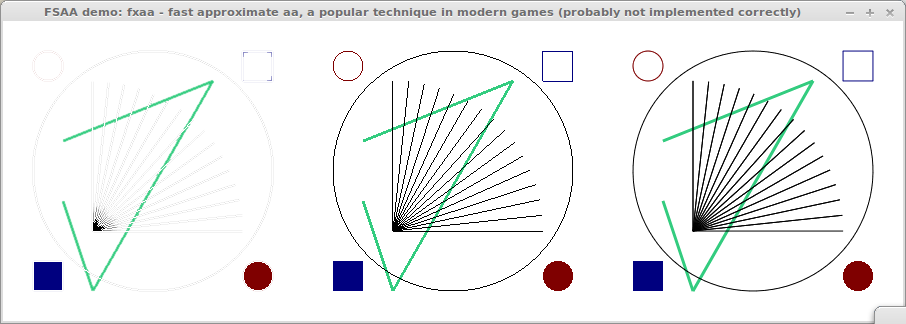
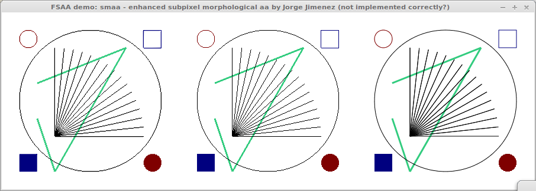
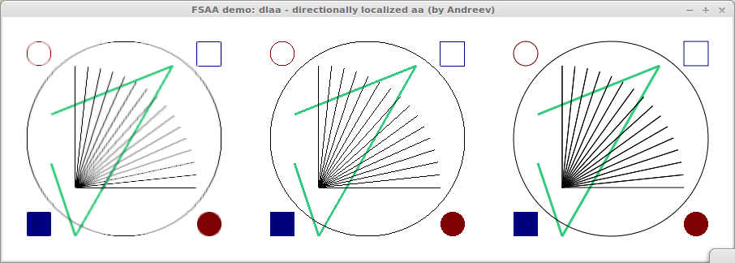
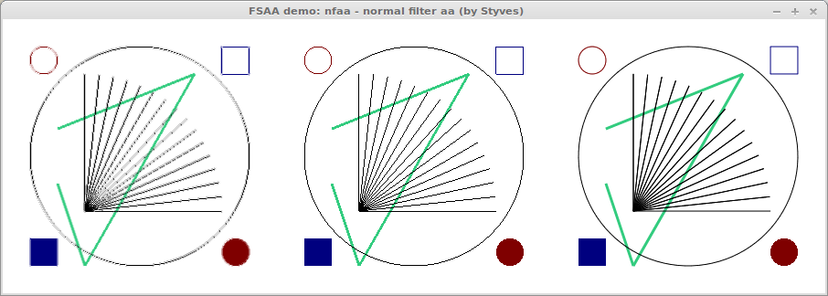
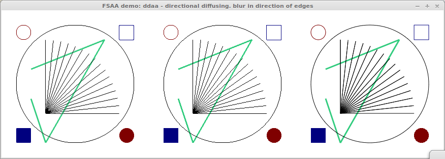

==================================
Techniques to perform antialiasing
==================================

Antialiasing is a collective name for techniques that undo or prevent aliasing,
i.e. jagged edges. To create visually appealing graphics, antialiasing is
crucial, in particular for creating publication quality graphics.

The antigrain geometry library (agg) can be considered the gold standard in
this respect. It is the recommended backend in Matplotlib. But it is software;
we're interested in techniques that can be applied on the GPU.

This document tries to give an overview of available techniques to perform
antialiasing, and to describe their advantages and disadvantages.

Anti-aliasing "while drawing"
=============================

Conventionally, antialiasing is performed at the moment that stuff is
drawn. This usually involves calculating the coverage of a fragment, and then
using alpha (i.e. transparency) to scale that fragment accordingly.

GL_LINE_SMOOTH
--------------

When drawing lines, you can glEnable GL_LINE_SMOOTH to create antialiased
lines. The exact appearance and quality of the rendering can differ between
video card and drivers.

Multisample antialiasing (MSAA)
-------------------------------

`MSAA <http://en.wikipedia.org/wiki/Multisample_anti-aliasing>`_ is the common
method to perform anti-aliasing in video games. In entails calculating multiple
samples per fragment that are combined right before they enter the
fragment-shader stage. Therefore, it does not apply anti-aliasing on your
custom shader output.

This is trick that most hardward vendors provide. Not something that we can
implement ourselves. To enable it we should enable GL_MULTISAMPLE, and need to
"turn it on" when the OpenGL context is created.

This techniques applies to polygons only, and is considered to be quite expensive.

GLAGG
-----

Nicolas has a `repository <https://github.com/rougier/gl-agg>`_ in which he
collects several demos and experiments to produce agg quality rendering of 2D
geometry in OpenGL.

The results look really good, and it shows that OpenGL can produce publication
quality rendering for 2D plotting. However, I wonder how well this scales up to
3D, depth-buffering and transparency, and very large datasets.

Full screen anti-aliasing (FSAA)
================================

This is the name for a collection of techniques that perform the anti-aliasing
as a post-processing step on the fragment data. It means that all geometry in
the scene can be drawn without caring about aliasing, as the resulting image
will be processed as a whole.

Except for SSAA, the techniques mentioned below work on the raw pixel data in
the eventual resolution. In other words, the aliasing has already taken
place. In effect, these methods try to reconstruct the underlying structure of
the image and use it to create an antialiased image from the raw data. This
means that such techniques are theoretically limited in what the can
do. However, they can be pretty smart and produce results that can be as good
as other antialiasing techniques.

The advantages are:

  * In normal drawing, you don't have to care about antialiasing. You fix it in
    the end, using a single method, instead of a method for each kind of data.

  * For large polygon counts, FSAA is often faster. This is the reason why it
    is used more and more in games.
  * All fragments of an opaque object are really opaque. This makes handling
    transparency in a correct (and fast) way much easier.

Of course, there are also disadvantages:

  * The aliasing has already taken place; it is more like "reduce the effects
    of aliasing" instead of "anti aliasing". SSAA is an exception to this.
  * This means that there are situations where errors are made or where the
    correct visualization can simply not be retrieved.
  * It is pretty hard to come up with a method that performs well in many
    circumstances. The result will in general not be as good as e.g. MSAA.
  * You would not be able to have non-integer line widths. Perhaps this is acceptable, perhaps not.

So you can regard it as being more flexible and faster, at the cost of
quality. How much quality? We need to find that out. Techniques that work well
with content that is already antialiased would help a lot, because then we
could mix different aa techniques. The post-processing filter would then help
remove the effects of the stuff that was not already anti aliassed.

I list a couple techniques below, but there are much more. These are the most
well-known ones. For a more complete overview see the SMAA paper.

Supersampling antialiasing (SSAA)
---------------------------------

This technique is the simplest of them all; you simply render your scene at X
times the screen resolution and then downsample it right before blitting it to
the screen. The results can be really good, but performance-wise this is a very
expensive technique.

This is the only fsaa technique listed here that performs true **anti**
aliasing. It should therefore realize the best results, and (when applied with
sufficient upsampling) be used as a golden standard.  I think something like
this can be of use, for instance for creating high resolutions screenshots.

In the image below, the left image is the ssaa result; the center is the
aliased image; the right is the result if GL_LINE_SMOOTH would have been used.

Fast approximate antialiasing (FXAA)
------------------------------------

`FXAA <http://developer.download.nvidia.com/assets/gamedev/files/sdk/11/FXAA_WhitePaper.pdf>`_
is a technique that detects sharp edges and then blurs these. Jeff Atwood was
very `enthusiastic about it <http://www.codinghorror.com/blog/2011/12/fast-approximate-anti-aliasing-fxaa.html>`_. It claims to produce similar results as MSAA, but at a much lower cost.

The code is available, but you kind of have to look for it. I was only able to
find version 3.11 (and earlier). It can be seen in the image below that it
cannot handle thin lines well. This is supposed to be "fixed" in a later
version (which I cannot get my hands on). However, the result is so bad that I
suspect that I am also not using the code correctly.

Enhanced subpixel morphological antialiasing (SMAA)
---------------------------------------------------

`SMAA <http://www.iryoku.com/smaa/>`_ is a technique that (like FXAA) works on
the raw image that is of the same resolution as the screen. It goes much
further than FXAA and analyses the underlying shape of the edges. According to
the paper, it takes all problems into account in a modular way. The video is
quite impressive. Especially the part where they show rotating grids gives me
hope in this technique.

The technique involves multiple passes and can be configured in several
ways. So yo use it requires a little more reading-up then FXAA does. But the
source code is freely available. The technique is a little more involved since
it requires 3 render passes and some multi-texturing with pre-computed textures
which are used as look-up tables.

I think I've got it working, see the image below. I am a bit disappointed in
the results. The bad quality might be because SMAA was made for games, not for
high contrast line images such as these.

Marching squares inspired antialiasing
======================================

Marching squares (or marching cubes, in 3D) is a technique to detect the
contour of an object from image data. It is quite good in estimating the shape
of the object by analyzing the relation of the pixel values.

I tried to use a similar technique to estimate the shape of the edge and then
use that information to blur the edge in a smart way. The results are not
optimal; the lines get a little wobbly. The problem is how to smooth the
information of the direction/shape of an edge.

Directionally localized antialiasing (DLAA)
-------------------------------------------

The key idea of `DLAA
<http://and.intercon.ru/releases/talks/dlaagdc2011/slides/>`_ is to find the
direction of an edge, and blur in that direction.

Normal filter antialiasing (NFAA)
---------------------------------

Here too, `NFAA
<http://www.gamedev.net/topic/580517-nfaa---a-post-process-anti-aliasing-filter-results-implementation-details/>`_
calculates the gradient, then the normal to it, and smooth in its direction.

Directional diffusion antialiasing (DDAA)
-----------------------------------------

Thinking that the idea of the above two approaches makes a lot of sense, I set
out on improving on them. A key problem in their methods is that the derivative
kernels used in determining the gradient are not rotationally invariant **at
all**. With some extra diffusion of the gradient field and a few other tweaks,
I was able to get the result shown in the image below.

You can see how the image is really crisp, there is no notion of stuff being
overly smooth (because all smoothing takes places along the edge). This means
that this technique is very friendly to content that is already antialiased, as
the image below demonstrates. The left image shows the result of DDAA applied
to the right image (instead of the center one).

.. image::_static/fsaa_demo_ddaa+.png

DDAA suffers from undersampling at near-horizontal and near-vertical edges, so
there is some room for improvement.

Discussion
==========

I think that DDAA offers a good technique for antialiasing content at a very
low cost and much increased flexibility, for instance with regard to handling
transparency. The quality is pretty good, although not as good as some other
methods.

For taking screenshots, I thing SSAA might be a good option. Or perhaps simply
create a screenshot at higher resolution (and DDAA for AA).

The fact that DDAA plays nice with content that is already smooth, makes that
we can use better techniques (such as glagg or MSAA) when necessary. We might
not even have to turn the DDAA off.
